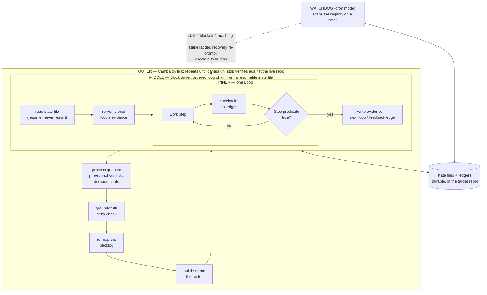

# phil

Agent loop/Block orchestration system. Named for Phil Connors (*Groundhog Day*). Keep going until you find happiness.

## Why phil instead of a bare `/goal` or `/loop` prompt?

Claude Code, Codex, and most agent runtimes ship some flavor of "keep going until it's done" — a goal command, a loop prompt, a YOLO flag. They all share the same failure modes: the model grades its own homework, "done" means "the model decided to stop," and when the session or context window dies, the work evaporates. phil is what those commands grow up into:

| | bare `/goal` / `/loop` | phil |
|---|---|---|
| **Stop condition** | the model's own judgment | a testable predicate, lint-enforced — "until happy" without a give-up bound fails the build |
| **Session dies** | progress evaporates; restart from the prompt | resumable state file — a fresh agent with zero memory loses at most one checkpoint interval |
| **"Done" claims** | trusted | prior evidence is re-verified before advancing; repeated verify failures trip a thrashing cap |
| **Scope** | whatever the prompt said | mandatory ground-truth check + full backlog mapping before anything runs |
| **Multi-step work** | one prompt, one shot | Blocks: ordered loop chains with feedback edges, iteration caps, and honest `blocked` states |
| **Human input** | blocks the run, or gets skipped | emulated gates: a fresh-context frontier-tier verdict, recorded provisionally, human ratifies async |
| **Oversight** | none | Watchdog scans every registered Block: stale / blocked / thrashing → strike ladder → recovery re-prompt |
| **Cost** | unbounded | per-pass cost lines, budgets, and rung attribution — expensive passes never re-find what a cheap script could catch |
| **Lock-in** | that runtime's command | runtime- and model-agnostic: capability tiers + adapter table, works on any agent system |

### The three loops and the Watchdog



- **Inner — a Loop:** one unit of work run to a *testable* Stop, checkpointing to a ledger at every significant step. Taste loops carry explicit give-up bounds; ground-truth loops carry numbers.
- **Middle — the Block driver:** executes an ordered chain of loops from a state file any fresh agent can pick up. It re-verifies the previous loop's evidence instead of trusting it, halts honestly on `blocked` instead of skipping, and re-queues earlier loops through capped feedback edges.
- **Outer — the Campaign tick:** re-checks ground truth, re-maps the backlog, rebuilds the roster, drives it, processes the human's queues — and repeats until the campaign's stop predicate verifies true against the live repo, not until a transcript ends.
- **Watchdog (cron mode):** a deterministic scan plus LLM triage over every registered state file. Stale, blocked, or thrashing Blocks climb a strike ladder — recovery re-prompt first, human escalation last — so unattended work can't silently die.

Every layer reads and writes durable files, which is the whole trick: any runtime, any model, any fresh context resumes exactly where the last one stopped.

- **`loops.md`** — the small index and shared loop contract.
- **`loops-core.md`** — general-purpose loops such as triage, bug fixing, coverage, review, and documentation.
- **`loops-pipeline.md`** — the Product Pipeline and build/validate loops.
- **`loops-ux.md`** — UX and validation loops (UI design, visual inspection, mechanical sweeps, simulated-user passes, user tests, onboarding).
- **`loops-hardening.md`** — hardening, compatibility, observability, and release loops.
- **`blocks.md`** — the Blocks system: state-file schema, Driver Protocol, and reusable Block templates. (Live instantiated-Block records go in `instances.md`, an owner-local file excluded from delivered artifacts.)
- **`cron-mode.md`** — cron-only machinery (Watchdog Loop, driver cron pre-flight, cadence, deliver tiering). Read only when crons are armed; inline mode ignores it.
- **`tmp/watchdog.md`** / **`tmp/watchdog-registry.md`** — the Watchdog Loop's cross-repo health ledger and registry of Blocks it monitors (runtime state, created on first watchdog use; absent from the delivered artifact — cron mode only).
- **`models.md`** — the available model/provider roster used by judgment loops and drivers.
- **`PORTABILITY.md`** — cross-platform + cross-runtime rules (Windows local / Ubuntu VPS, Claude Code / Hermes): path resolution, LF line endings, per-host watchdog registry, runtime tool forks.
- **`PARALLEL.md`** — **design record, not active doctrine**: the deterministic architecture for running multiple Blocks in parallel on one repo (per-Block worktree cells, leases, fixed merge-order + CAS integration, verify-isolation contract). phil today is still sequential-per-repo; this is the spec for when it's built.

The deployable skill shim (`phil`, the thing that turns "phil on myproject, git'r dun" into action) lives wherever your runtime discovers skills — Claude Code: `~/.claude/skills/phil/` (the `deploy-skill.sh` default); other runtimes (OpenCode, Hermes, OpenClaw, ...): pass their skill dir as `deploy-skill.sh` arg 2, or point the agent at `skill/SKILL.md` directly. The shim points back into this repo rather than duplicating it.

Everything here is meant to be read fresh each time, not cached or quoted from memory. Start with `loops.md`, then follow its category links.

## Install

Prerequisites: `bash` + GNU coreutils (Windows: use git-bash, which ships both) and any agent runtime that can load a skill file (Claude Code, OpenCode, Hermes, OpenClaw, ...) with any model roster (`models.md` maps models to capability tiers).

**From a git clone** (recommended — keeps the pre-commit lint gate):

```bash
git clone <this-repo> phil && cd phil
git config core.hooksPath .githooks      # arm the pre-commit lint gate
bash scripts/deploy-skill.sh             # generate the ~/.claude/skills/phil/ shim for THIS machine
```

**From a release archive** (no `.git`, so skip the hooks step):

```bash
unzip phil-release.zip -d phil && cd phil
bash scripts/deploy-skill.sh
```

Then say `phil on <your-project>` in an agent session. Re-run `deploy-skill.sh` after any structural change to `skill/references/` or the repo-root docs. Full cross-platform rules: `PORTABILITY.md`.

Build a release archive from a clone: `git archive HEAD -o phil-release.zip` (owner-local state — `tmp/`, `archive/`, `instances.md` — is excluded via `.gitattributes` `export-ignore`).
